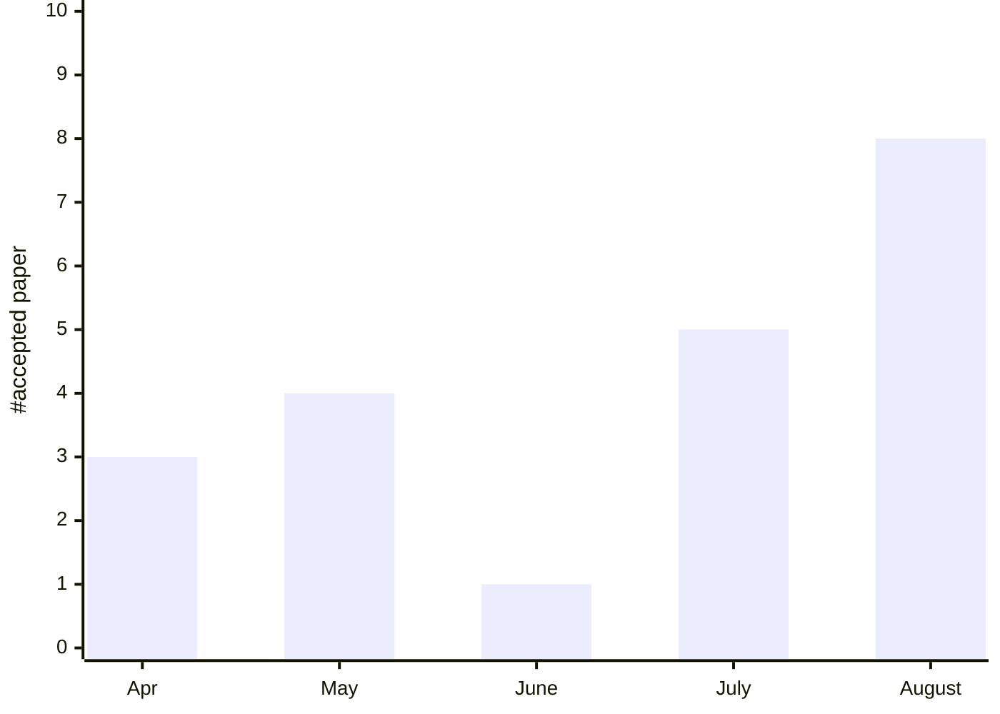

# Testing for 37247004

$a = x^2$

> [!NOTE]
> I'm hungry. WHere is good ramen restaurant

```mermaid
xychart-beta
    x-axis [Apr, May, June, July, August]
    y-axis "#accepted paper" 0 --> 10
    bar [3, 4, 1, 5, 8]
```
